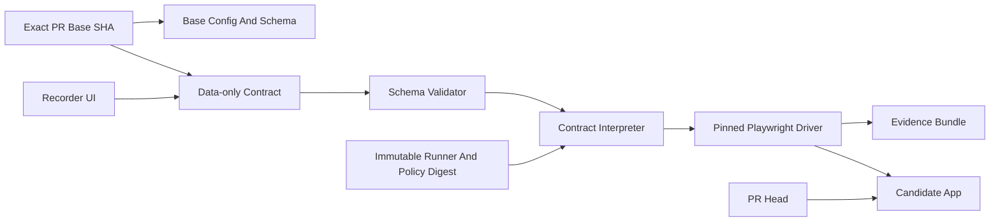

# StillWorks Project Plan

> Project name: StillWorks<br>
> Product line: **Show it once. Keep it working.**<br>
> Secondary line: **Your agent can edit the code, not the definition of done.** *(Protected
> Attestation target; see the qualified V0 claim below.)*<br>
> Planning snapshot: 2026-07-18

## 0. Tóm Tắt Thực Thi Bằng Tiếng Việt

### Mục tiêu

Xây một công cụ open-source giúp lập trình viên ghi lại một luồng browser quan trọng bằng các
checkpoint semantic, sau đó kiểm tra thay đổi bằng contract được chọn cục bộ hoặc oracle lấy từ đúng
base SHA của PR.

V0 thành công khi:

- Người mới tạo contract đầu tiên trong dưới 5 phút.
- Refactor DOM/CSS nhưng giữ nguyên hành vi vẫn pass.
- Regression thật về navigation, state hoặc persistence bị bắt đúng checkpoint.
- Khi PR Drift Gate đã cấu hình chạy đúng, PR sửa cả code lẫn contract vẫn bị chấm bằng contract lấy
  từ đúng base SHA trong lần chạy đó.
- Có ít nhất 5 repo private alpha và 3 repo giữ check sau hai tuần.

### Mục đích

StillWorks không tồn tại chỉ để “chống AI”. Nó giải quyết hai việc:

1. Giúp dev biến manual acceptance flow thành regression check nhanh hơn viết E2E test bằng tay.
2. Khi code được viết bởi agent hoặc contributor, tách oracle đang chấm khỏi candidate patch và luôn
   hiển thị đề xuất đổi tiêu chí để reviewer nhìn thấy. V0 không tự suy ra rằng đề xuất đã được người
   duyệt.

### Thứ tự bắt tay vào làm

1. Viết threat model, contract schema và ba demo scenario.
2. Làm vertical slice bằng contract viết tay: semantic refactor pass, persistence regression fail.
3. Song song phỏng vấn 15 người và chạy 5 concierge pilot.
4. Chỉ khi core có nhu cầu và đủ ổn định mới làm recorder UI.
5. Sau recorder mới làm report, CLI và GitHub Action chọn oracle từ đúng base SHA.
6. GitHub App, protected approval, contract cho HTTP service hoặc command process chỉ được làm sau các
   demand gate trong tài liệu. CLI của chính StillWorks vẫn thuộc V0.

### Nguyên tắc quyết định

```text
Pain -> Authoring experience -> Replay reliability -> PR drift gate -> Protected enforcement
```

Codex giúp tăng tốc code, nhưng không được dùng tốc độ để bỏ qua validation, threat model hoặc Definition of Done.

## 1. Executive Summary

StillWorks lets a developer demonstrate one critical browser workflow, select a few semantic checkpoints, and turn that intent into a durable, data-only behavior contract.

Local checks replay the contract selected by the user. When the configured PR Drift Gate executes as
specified, it loads contract, config, and schema from one exact base SHA and runner semantics from an
immutable pinned release; a proposed head bundle cannot replace that oracle for the invocation.

The project has two independent reasons to exist:

1. **General developer value:** create and maintain a useful regression check faster than hand-writing an end-to-end test.
2. **AI-amplified value:** make head goalpost changes visible while keeping them out of the
   base-selected oracle used by the configured V0 check. Non-bypassable protection is a post-V0 goal.

The first release is deliberately narrow: one deterministic, loginless Chromium flow in a TypeScript web app. It is not a visual testing suite, a full autonomous QA system, formal verification, or proof of full-stack correctness.

## 2. Product Charter

### Mission

Make critical user behavior explicit, replayable, and human-owned as software changes accelerate.

### Problem

Teams still manually click through important flows because writing and maintaining E2E tests is expensive. Existing tests can also evolve in the same pull request as the implementation, so a green CI result does not always mean the previously accepted behavior survived.

### Purpose

- Reduce the time required to turn a manual acceptance flow into an automated regression gate.
- Catch user-visible behavioral regressions before merge.
- Make intentional behavior changes explicit and reviewable.
- Give reviewers concrete evidence: failed step, expected and actual semantics, screenshot, console output, and Playwright trace.
- Create an independent oracle for PRs authored by humans or coding agents.

### Product Goals

1. A new user records their first stable contract in under five minutes.
2. A semantic DOM refactor passes when user behavior is unchanged.
3. A real persistence/navigation/state regression fails at the exact checkpoint.
4. A configured PR Drift Gate evaluates a PR with the accepted bundle from one exact base SHA and an
   immutable runner release, independent of proposed head contract/config edits.
5. Contract proposal status remains separate from the base replay verdict.
6. Contracts contain no executable code and are readable in code review.

Post-V0, Protected Attestation may approve a proposed bundle without a second PR. That approval must
be externally enforced and bound to every identity, commit, bundle, runner, and policy input listed
in [`docs/THREAT_MODEL.md`](docs/THREAT_MODEL.md).

### Non-Goals For V0

- Replacing unit, integration, accessibility, security, or full E2E suites.
- Formal verification, autonomous QA, or proof of full-stack/backend correctness.
- Browsers other than pinned Chromium, native-mobile flows, or desktop-application flows.
- Pixel screenshots as the pass/fail oracle.
- Production traffic or session recording.
- MFA, passkeys, third-party SSO, or committed cookies/raw `storageState`.
- WebSocket, SSE/EventSource, service worker, dedicated/shared web worker, WebTransport, WebRTC,
  multi-tab, cross-origin iframe, or real-time collaborative flows.
- Arbitrary JavaScript, shell, imports, callbacks, XPath, arbitrary CSS selectors, or executable
  regex in contracts.
- AI self-healing or automatic contract approval.
- HTTP-service or command-process behavior contracts. StillWorks' own `init`, `record`, `check`, and
  `diff` CLI remains in scope.
- A hosted dashboard, IDE extension, or MCP integration.
- A security sandbox, hostile-candidate isolation, or defense against an app deliberately detecting
  or attacking browser automation.
- Protecting credentials deliberately exposed to candidate code, or guaranteeing arbitrary app/user
  content and evidence are secret-free.
- Protection from malicious maintainers/admins, compromised trusted dependencies/platforms, browser
  zero-days, or runner escapes.

## 3. Initial User

### Primary ICP

A senior full-stack engineer or tech lead in a 2-15 engineer product team who:

- Ships a TypeScript web application weekly.
- Uses GitHub Actions.
- Has incomplete E2E coverage.
- Still manually checks at least one checkout, onboarding, pricing-to-signup, or persistence flow.
- Uses Codex, Claude, Cursor, or another coding agent regularly.
- Can start a deterministic test build with one command.

### Secondary ICP

General web developers and open-source maintainers who do not use coding agents heavily but want a faster way to create durable behavioral regression checks.

### JTBD

> When I review a PR touching a critical flow, I want to record the definition of done as a few semantic checkpoints and replay it independently on the candidate code, so I can merge without repeating a manual browser tour or trusting a test changed in the same PR.

## 4. Core Product Experience

### Happy Path

```bash
npx stillworks init --start "pnpm start:test"
npx stillworks record http://127.0.0.1:3000 --flow checkout
npx stillworks check
npx stillworks check --base origin/main
```

1. StillWorks starts or connects to the app.
2. A headed Chromium window opens.
3. The developer performs the flow normally.
4. An overlay lets the developer pin 3-8 meaningful checkpoints.
5. StillWorks emits `.stillworks/checkout.json`.
6. `check` replays the contract locally.
7. The configured CI check resolves and records one exact PR base SHA, loads its accepted bundle plus
   an immutable runner release, and runs that oracle against the candidate app.
8. A failure produces a semantic diff and evidence bundle.
9. Any governed head-bundle change is reported as `CHANGE_REQUIRES_APPROVAL`, independently of the
   base replay verdict. V0 does not decide that a proposal is legitimate or approved.

### Contract V0

Supported actions:

- `visit`
- `click`
- `fill`
- `select`
- `check`
- `reload`

Supported locators:

- `role + accessible name`
- `label`
- `testId`

Supported assertions:

- `visible` / `hidden`
- `url`
- `text`
- `value`
- `count`
- `checked`
- `disabled`

Example:

```json
{
  "version": 1,
  "flow": "checkout",
  "steps": [
    { "visit": "/checkout" },
    { "click": { "role": "button", "name": "Place order" } },
    { "assertUrl": "/checkout/success" },
    { "assertVisible": { "role": "heading", "name": "Order confirmed" } },
    { "reload": {} },
    { "assertVisible": { "role": "heading", "name": "Order confirmed" } }
  ]
}
```

The schema must use `additionalProperties: false` plus explicit byte, depth, node, string, step-count,
and URL-operand limits. `SW-003` owns canonical serialization and stable hashing.

### Result Model

Replay and governance use independent axes:

- `executionVerdict = PASS`: the base-selected behavior holds for this replay.
- `executionVerdict = REGRESSION`: a base-selected checkpoint fails on candidate code.
- `executionVerdict = FLAKY`: replay outcomes disagree across diagnostic reruns. Never convert this
  to pass.
- `executionVerdict = INFRA_ERROR`: app readiness, browser, dependency, provenance, or runner failure.
- `proposalStatus = UNCHANGED`: no governed contract/config artifact changed at head.
- `proposalStatus = CHANGE_REQUIRES_APPROVAL`: a governed artifact was added, edited, deleted,
  renamed, redirected by symlink, or otherwise changed, regardless of replay outcome.

Protected Attestation may later add `proposalStatus = APPROVED`. V0 never activates a head proposal
automatically.

## 5. Success Definition

### North-Star Metric

**Weekly repositories running StillWorks as a PR check.**

Stars measure distribution. A required check that remains enabled measures product value.

### V0 Acceptance Metrics

- Median time to first stable contract: under 5 minutes.
- Clean-flow unexpected failure rate: under 2% across 50 consecutive runs.
- Seeded semantic regression recall: at least 80% in concierge, at least 90% before public beta.
- Intentional-change review time: under 2 minutes.
- StillWorks never intentionally serializes cookies, authorization headers, or browser storage
  state; password capture is rejected and tested redaction runs before persistence. Evidence remains
  sensitive, and arbitrary page/user content cannot be guaranteed secret-free.
- At least 3 of 5 concierge pilots keep the check after two weeks.
- At least 5 private-alpha repositories remain active in week four.

## 6. Execution Strategy

Validation and implementation run in parallel. The dependency order is:

```text
Pain -> Authoring experience -> Replay reliability -> PR drift gate -> Protected enforcement
```

Do not build the GitHub App, hosted dashboard, or additional protocols before the authoring and replay loop proves useful.

## 7. Six-Week Build Plan

| Phase | Objective | Purpose | Required Output | Exit Gate |
|---|---|---|---|---|
| Days 1-2: Charter pack | Make the promise and boundaries unambiguous | Prevent building a generic recorder or making false security claims | One-minute mock demo, sample contract/report, threat model, interview script, event taxonomy | An external developer explains the product correctly in 30 seconds |
| Week 1: Contract foundation | Define the stable product kernel | Make every later surface depend on a small, auditable data model | JSON Schema v1, validator, canonical hash, semantic diff, two-axis result model | Malformed and executable-looking contracts fail closed |
| Week 2: Vertical slice | Prove one handwritten contract can catch one real regression | Validate the core before building recorder UX | Chromium interpreter, semantic locators, app readiness, persistence demo | Stable refactor passes; persistence bug fails after reload |
| Week 3: Recorder | Remove the need to hand-edit JSON | Test the acquisition surface and broad developer value | Action capture, assertion picker overlay, redaction, replay preview | A pilot records a five-step flow unaided |
| Week 4: CLI and evidence | Make failures easy to understand and share | Turn a runner into a usable developer tool | `init`, `record`, `check`, `diff`, HTML/JSON report, console, screenshot, trace | Reviewer locates root checkpoint in under two minutes |
| Week 5: Base-selected PR gate | Evaluate candidate code with the accepted bundle from one exact base SHA | Deliver the conditional artifact-selection differentiator | Exact-SHA loader, provenance-separated workspaces, immutable runner, read-only GitHub Action, proposal detection | Inside the configured check, head bundle edits cannot change the selected oracle; replay and proposal results remain independent |
| Week 6: Hardening and alpha release | Make the narrow claim reliable | Earn permission to recruit real repositories | Security/fuzz suite, mutation corpus, 100-run soak, 3 demos, npm package, docs | All V0 Definition of Done items pass |

The dates are targets, not reasons to lower reliability. If validation fails a gate, stop that workstream and resolve the failure before adding features.

## 8. Parallel Validation Plan

### Phase A: Artifact Interviews, Week 1

Run 15 interviews:

- 5 agent-heavy small web teams.
- 5 ordinary web developers with partial E2E coverage.
- 5 mature QA/platform engineers as skeptical controls.

Ask them to show, not describe:

1. The most recent user-visible regression that passed CI.
2. The PR and tests connected to it.
3. The flow they still click manually before merge.
4. Why Playwright/Cypress does not already cover it.
5. Their exact app start, auth, seed-data, and external-service setup.
6. After the mock demo, ask them to choose three checkpoints and schedule a pilot.

Interview gate:

- At least 8/15 have a meaningful recent regression.
- At least 6/10 teams without mature QA manually verify UI weekly.
- At least 5 agree to a dated pilot on a real repository.

### Phase B: Concierge Pilots, Weeks 1-2

Use existing Playwright primitives behind the scenes on five real repositories. Do not wait for the recorder.

For each repository:

- Encode one flow with 3-8 checkpoints.
- Run 20 unchanged replays.
- Seed four semantic regressions.
- Simulate one intentional behavior change.
- Measure setup time, false failures, caught regressions, and approval time.

Continue only if 3/5 teams want to keep the check after two weeks.

### Phase C: Private Alpha, Weeks 3-6

- Target 10 repositories.
- Observe at least 100 PR checks.
- Require two real regressions caught before public beta.
- Track funnel: install -> first contract -> first CI run -> week-four active.
- A/B positioning: general regression promise versus AI goalpost promise.

If agent-heavy teams retain but ordinary teams do not, narrow the positioning to agent-native instead of pretending the market is broad.

## 9. Technical Architecture



Recommended stack:

- TypeScript strict mode.
- Node.js current LTS.
- pnpm workspaces.
- Playwright with pinned Chromium.
- JSON Schema plus Ajv.
- Vitest for unit/integration tests.
- Static HTML report requiring no hosted service.
- Git commands invoked as argument arrays, never interpolated shell strings.
- No Turborepo until build complexity proves it is needed.

### Repository Layout

```text
stillworks/
  packages/
    contract/           # schema, types, canonicalization, semantic diff
    interpreter/        # deterministic step state machine
    playwright-driver/  # Chromium adapter, guards, trace capture
    recorder/           # headed recorder and checkpoint overlay
    reporter/           # HTML, JSON, Markdown evidence
    cli/                # init, record, check, diff
  action/               # reference GitHub Action
  services/
    github-app/          # protected enforcement, only after V0 demand
  demos/
    todo-persistence/
    semantic-refactor/
    contract-tamper/
  benchmarks/
    mutations/
    flake-soak/
  tests/
    contracts/
    malicious-contracts/
    synthetic-repos/
  docs/
    threat-model.md
    contract-spec.md
    github-enforcement.md
    adr/
```

## 10. Trust And Security Model

[`docs/THREAT_MODEL.md`](docs/THREAT_MODEL.md) is canonical. The three levels are:

| Level | Availability | Narrow guarantee |
|---|---|---|
| **Local Cooperative** | V0 target | Replays the locally selected contract; no ownership, approval, or tamper-resistance claim |
| **PR Drift Gate** | V0 target after `SW-015` | If the configured check executes as specified, the accepted bundle from one exact base SHA and an immutable runner digest form the oracle; head bundle edits cannot replace it for that invocation |
| **Protected Attestation** | Post-V0 after `SW-023` | External enforcement plus isolated execution prevents candidate control of the oracle, approval, and check implementation; changes to any bound input invalidate approval |

PR Drift Gate protects artifact selection only. It assumes trusted CI metadata, control plane, runner,
pinned release, and host, and assumes candidate code does not attack the same-user runner. A hostile
candidate may forge or suppress a result; provenance-separated directories are not isolation.

CI controls:

- Use `pull_request`, never execute candidate code under `pull_request_target`.
- `permissions: contents: read` or less.
- `persist-credentials: false` for candidate checkout.
- Do not expose GitHub tokens or secrets to the candidate app.
- Use an ephemeral hosted runner with no privileged internal-network route. Persistent self-hosted
  runners are unsupported for untrusted PRs unless independently isolated by the deployment owner.
- Keep base artifacts and candidate source in separate workspaces for provenance and cleanup, without
  treating those directories as isolation.
- Resolve contract/config/schema from one exact base SHA and runner/action semantics from one recorded
  immutable release digest. Record both with the verdict and never fall back to head.
- Restrict routed document, subresource, and fetch traffic, including redirects, to one exact
  loopback origin through a cookie-isolated direct transport. Override launch proxies with an owned
  loopback deny proxy and reject unsupported realtime/worker APIs. V0 does not claim complete
  browser- or process-wide egress control.
- A privileged approval workflow must never checkout or execute PR code.
- Escape all report content to prevent stored XSS.
- Apply size, depth, timeout, navigation, and evidence-retention limits.
- Treat every evidence bundle as sensitive, omit network bodies by default, reject password capture,
  redact configured patterns, escape reports, and bound retention.

Do not claim protection from repository administrators, malicious apps detecting automation, browser
zero-days, runner escapes, or every form of CI tampering. Protected Attestation requires an external
control plane **and** ephemeral secretless isolated execution with egress and resource limits; a
GitHub App or required workflow alone is not a sandbox.

## 11. Issue-Level Backlog

| ID | Deliverable | Dependency |
|---|---|---|
| SW-001 | Threat model, guarantees, explicit non-goals **(complete)** | - |
| SW-002 | JSON Schema v1 with `additionalProperties: false` **(complete)** | SW-001 |
| SW-003 | Canonical serialization and stable contract hash **(complete)** | SW-002 |
| SW-004 | Semantic locator resolver **(complete)** | SW-002 |
| SW-005 | Interpreter state machine, timeout, cancellation **(complete)** | SW-004 |
| SW-006 | Same-origin navigation and network guard **(complete)** | SW-005 |
| SW-007 | Chromium driver, app readiness, and handwritten persistence vertical slice | SW-005, SW-006 |
| SW-008 | Recorder action capture | SW-004 |
| SW-009 | Overlay for checkpoint/assertion selection | SW-008 |
| SW-010 | Password, cookie, token, sensitive-input redaction | SW-008 |
| SW-011 | Trace, screenshot, console, network-failure evidence | SW-005 |
| SW-012 | Human-readable semantic contract diff | SW-003 |
| SW-013 | CLI `init`, `record`, `check`, `diff` | SW-009, SW-011 |
| SW-014 | Exact base-SHA contract/config/schema loader | SW-003 |
| SW-015 | Read-only `pull_request` GitHub Action | SW-014 |
| SW-016 | Independent proposal status for every governed head-bundle change | SW-012, SW-015 |
| SW-017 | Malicious-contract property/fuzz suite | SW-002, SW-006 |
| SW-018 | Three demo apps and mutation corpus | SW-013, SW-015 |
| SW-019 | Cross-platform and 100-run flake soak | SW-018 |
| SW-020 | npm provenance, release automation, pinned Action SHA | SW-017, SW-019 |
| SW-021 | Quickstart, contract spec, threat model, CI guide | all V0 work |
| SW-022 | Fully bound maintainer approval record | post-V0 |
| SW-023 | External enforcement and isolated ephemeral execution | demand gate |

## 12. Test Strategy

### Unit

- Schema validation and migration.
- Canonical hashing.
- Semantic contract diff.
- Locator resolution and ambiguity handling.
- Interpreter transitions, timeouts, and cancellation.
- Secret redaction and report escaping.

### Property And Security

- Unknown opcodes and additional fields.
- Oversized strings and excessive nesting.
- Malformed Unicode.
- Path traversal and external URLs.
- Prototype pollution payloads.
- Report HTML/script injection.
- PR attempts to edit/delete contract, config, schema, runner, or workflow.

### Integration And E2E

- Synthetic page for every action/assertion.
- Record then replay all three demo applications.
- Windows, macOS, and Linux local smoke tests; Ubuntu enforcement CI.
- Pinned Chromium 100-run soak for core demos.
- Golden HTML/JSON/Markdown reports.
- Mutation corpus containing broken persistence, wrong totals, changed navigation, missing side effect, removed assertion, skipped test, mocked request, and contract tampering.

Retry is diagnostic only. It may label `FLAKY`; it must never turn a failing contract into `PASS`.

## 13. Definition Of Done V0

V0 is complete only when all items below are true:

- A new repository reaches its first stable contract in under five minutes.
- A developer records a five-step flow and chooses checkpoints without editing JSON.
- A class/DOM nesting refactor preserving semantics passes.
- A persistence regression fails after reload.
- When the configured PR check executes, a PR editing implementation and governed artifacts is
  evaluated with the accepted bundle from one recorded exact base SHA and an immutable runner digest.
- Replay verdict and proposal status are independent; every governed add/edit/delete/rename/symlink
  or config change is `CHANGE_REQUIRES_APPROVAL`, even when the base replay passes.
- Failure output identifies step, locator, expected/actual value, screenshot, console, and trace.
- Contracts contain no executable surface.
- Cookies, authorization headers, and raw browser storage state are never intentionally serialized;
  password capture is rejected, configured redaction is tested, and evidence is labeled sensitive.
- Three demos, mutation suite, security suite, and 100-run soak pass.
- README states guarantees and limitations above the fold.
- Five private-alpha repositories have used the tool; at least three kept it enabled for two weeks.

## 14. OSS And Launch Plan

### Positioning

Primary headline:

> **Show it once. Keep it working.**

Primary explanation:

> Record a critical browser flow, choose the outcomes that matter, and check candidate code against
> the base-selected behavior whenever the configured PR gate runs.

AI-specific line remains the memorable secondary hook, not the only market definition.

### Launch Assets

- `npx stillworks demo` completing in under 60 seconds.
- A 45-second GIF: an agent breaks persistence and edits the head contract; ordinary head tests pass,
  while the configured StillWorks check keeps the exact-base oracle, reports `REGRESSION`, and marks
  the proposal `CHANGE_REQUIRES_APPROVAL`.
- Three minimal demo repositories.
- A public mutation benchmark with reproducible results.
- Copy-paste local quickstart and GitHub Action.
- Static example failure report linked from the README.
- Clear comparison against Playwright codegen, visual snapshot tools, and CODEOWNERS.

### Distribution

- Show HN.
- Playwright Discord/community and testing communities.
- GitHub Action Marketplace.
- `r/webdev`, `r/Playwright`, and relevant JavaScript communities.
- Codex, Claude Code, Cursor, and agent workflow communities.
- Direct pull requests or assisted pilots for suitable open-source web apps, never spam comments.

### Contributor Surfaces

- Assertion opcodes.
- Reporter formats.
- Framework fixture recipes.
- Redactors.
- Demo regressions and mutation cases.
- Cross-platform bug fixes.
- Contract schema proposals through ADRs.

### Milestones

| Horizon | Product Goal | Community Goal |
|---|---|---|
| 30 days after beta | 25 qualified installs, 10 weekly CI repositories | 3 external contributors, first public regression story, 250-500 stars as a reach target |
| 90 days | 40 weekly repositories, 5 required checks, protected approval beta | 5+ contributors, 3 case studies, 750-1,500 stars as a reach target |
| 180 days | 120 weekly repositories and proven browser retention | 15 contributors, 10 regression stories, 2,000-4,000 stars as an ambitious outcome |

These star ranges are distribution hypotheses, not commitments. Do not optimize for stars before activation and retention. A smaller repository with real dependents and disciplined maintenance is a stronger hiring artifact than a launch spike with no users.

## 15. Kill And Pivot Rules

Stop or narrow the project if any of these remain true after two deliberate iterations:

- Fewer than 5/15 interviewees can show a painful relevant regression.
- Fewer than four teams accept a real pilot.
- Users cannot choose and maintain checkpoints without project-author help.
- False failures remain above 5% or regression recall remains below 80%.
- Fewer than 3/5 concierge pilots keep the check after two weeks.
- Most users say Playwright codegen plus CODEOWNERS is sufficient.
- More than half of the ICP has no usable flow because of auth or dynamic-state constraints.
- Intentional-change handling leaves more than 20% of ordinary PRs pending or takes over five minutes.

Pivot rules:

- Agent-heavy teams retain but ordinary teams do not: position as an agent-native guardrail.
- Users love evidence but reject the merge gate: pivot toward proof artifacts and PR behavior reports.
- Auth blocks the majority: narrow to component/demo environments or prioritize safe runtime auth references.
- Do not add HTTP-service or command-process contract targets until there are at least 10
  weekly-active browser repositories and three organic adapter requests. This does not block the
  StillWorks CLI.

## 16. Working With Codex 5.6 Sol Ultra

Use the model to increase implementation throughput without allowing it to blur product truth.

### Operating Model

- One GitHub issue is one bounded task with explicit acceptance criteria.
- Keep product guarantees, schema, and ADRs in the repository so every agent sees the same constraints.
- Use separate worktrees for independent epics.
- Assign one agent to implement and another to review threat-model violations, test gaps, and scope creep.
- Require runnable verification before merging every issue.
- Never let generated tests alone define acceptance; compare against the issue's human-written behavior criteria.
- Keep changes small enough that a reviewer can explain the behavioral effect.

### Required Repository Docs Before Scaling Agents

- `AGENTS.md`: commands, boundaries, code style, non-goals, security rules.
- `docs/product-charter.md`: mission, ICP, JTBD, success metrics.
- `docs/threat-model.md`: guarantees and exclusions.
- `docs/contract-spec.md`: versioned contract semantics.
- `docs/adr/`: immutable design decisions and alternatives rejected.
- `CONTRIBUTING.md`: setup, test matrix, PR expectations.

## 17. First-Day Checklist

Do these in order:

1. Reserve the StillWorks GitHub organization/repository and npm scope; confirm trademark, package, and domain availability before public beta.
2. Create the repository with MIT or Apache-2.0 license, Code of Conduct, Security Policy, issue templates, and Discussions.
3. Add `AGENTS.md`, product charter, threat model, and ADR-001 before implementation.
4. Create issues `SW-001` through `SW-007` and the three demo scenarios.
5. Build a 60-second fake-door demo/report before the real recorder.
6. Recruit the first five interviewees and book dates.
7. Implement the Week-2 vertical slice before polishing branding or the website.
8. Start a public build log only after the demo can show one regression clearly.

## 18. Immediate Decision

The first code milestone is **not the recorder**. It is this proof:

> A handwritten data-only contract runs on Chromium, a semantic refactor passes, a persistence regression fails after reload, and the report explains exactly why.

Once that works and at least several real users confirm the pain, build the recorder that makes the proof accessible.
